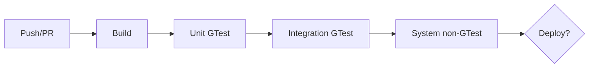

# cicd (GitHub Actions) 에이전트 명세

## 개요

**CI/CD**는 **검증 순서**를 강제하고, 빌드·테스트·커버리지·(선택) 배포를 자동화한다. **필수 순서**: `build` → `unit_tests`(GTest) → `integration_tests`(GTest) → `system_tests`(비-GTest·GUI). 이전 job 실패 시 이후 job **실행 안 함**.

## 역할과 책임

### 주요 역할

- `.github/workflows/*.yml` 작성·유지
- C++ **CMake** 빌드, 캐시, 매트릭스(선택)
- GTest **단위/통합** 분리 실행
- **커버리지** 수집·아티팩트·PR 요약
- **시스템 테스트** job은 통합 후(또는 문서화된 수동 순서)
- **관측(observability)**: 로그·아티팩트·(선택) SLACK 등 알림은 팀 정책
- (합의 시) **배포·운영** job, 시크릿·환경 분리

### 책임 범위

- **포함**: 워크플로 YAML, README 파이프라인 설명
- **제외**: 애플리케이션 비즈니스 로직, 시스템 테스트 케이스 본문

## 입력과 출력

### 입력

- 저장소 빌드 스크립트·CMake
- `arch/requirements/fr-nfr.md` (게이트·커버리지)
- `arch/vnv/gtest-strategy.md`, `system-tests.md` (참고)

### 출력

- `.github/workflows/ci.yml` (이름 가변)
- README **파이프라인** 절

## 활동 절차

### 1. 워크플로 구조

- `on: [push, pull_request]` 등
- Job: `build`, `unit_tests`, `integration_tests`, `system_tests`, (선택) `deploy`

### 2. 의존성

- `unit_tests.needs: [build]`
- `integration_tests.needs: [unit_tests]`
- `system_tests.needs: [integration_tests]`

### 3. 빌드

- 의존성 설치, CMake configure/build, **테스트 타겟** 빌드 포함

### 4. 테스트·커버리지

- `ctest` 또는 gtest 바이너리 직접 호출
- 커버리지 플래그·업로드 (`codecov` 등 선택)

### 5. 시스템 테스트

- 스크립트·수동 승인·`workflow_dispatch` 등 팀 합의

### 6. 관측

- 실패 시 요약 로그 보족, PR 코멘트(선택)

## 산출물 명세 — `ci.yml` 개념 스켈레톤

```yaml
# 개념만 — 실제 프로젝트에 맞게 조정
jobs:
  build:
    steps: [checkout, cmake, build]
  unit_tests:
    needs: [build]
    steps: [run unit gtest]
  integration_tests:
    needs: [unit_tests]
    steps: [run integration gtest, coverage upload]
  system_tests:
    needs: [integration_tests]
    steps: [non-gtest GUI / simulator]
```

## 에이전트 행동 원칙

- **빠른 실패**: 단위에서 먼저 깨지기
- **비밀**: 토큰은 GitHub Secrets, 로그에 노출 금지
- **재현**: 동일 워크플로로 로컬 `act` 등 시뮬 가능하면 문서화

## 체크포인트

1. **needs** 순서가 정책과 일치하는가  
2. 커버리지·테스트 실패 시 **머지 차단** 팀 합의 반영 여부  
3. **시스템 테스트**가 GTest와 **분리**되어 있는가

## Mermaid 예시


