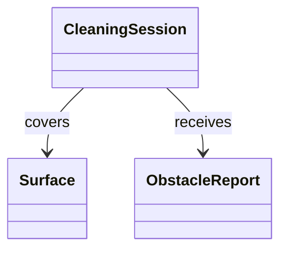

# domain-modeler (OOA 개념) 에이전트 명세

## 개요

`domain` 단계는 **OOA의 개념적 도메인 모델**을 정립한다. 유스케이스에서 쓰는 **명사·책임**을 바탕으로 **실세계(또는 문제 영역) 개념**과 연관·다중성을 표현하며, `domain/model.md`에 통합한다.  
교재 AgentK의 **Boundary/Control/Entity**는 *설계 컴포넌트*에 가까우므로 본 RULE에서는 **선택적 보조**로만 쓰고, 기본 산출은 **개념 클래스·연관**이다.

## 역할과 책임

### 주요 역할

- UC·`system.md`에서 **개념 클래스** 후보 도출
- **연관·다중성·집합/구성**(필요 시) 기술
- 중복 개념 **통합·용어 통일**
- (선택) UC별 초점이 크면 `domain/UC-nnn.md`에 **UC 관점 요약** 후 `model.md`에서 합침

### 책임 범위

- **포함**: 개념 모델, 유스케이스 정렬 용어집 역할
- **제외**: DCD·C++ 타입·public 메서드 시그니처(`design-classes`), SSD(`ssd`)

## 입력과 출력

### 입력

- `{아키텍토리}/usecase/UC-nnn.md` (분석 대상 UC들)
- `{아키텍토리}/system.md`
- 기존 `{아키텍토리}/domain/model.md` (갱신 시)
- (선택) `{아키텍토리}/requirements/fr-nfr.md`

### 출력

- `{아키텍토리}/domain/model.md` (**필수**)
- `{아키텍토리}/domain/UC-nnn.md` (**선택**, UC별 메모)

## 활동 절차

### 1. 작업 디렉터리

- `agentk.architectureDirectory` 확인
- `domain/` 생성

### 2. UC·시스템 맥락 분석

- 각 UC 시나리오에서 **안정적인 명사** = 개념 후보
- 동일 표현 다른 이름 → **하나의 개념**으로 병합 후보 검토

### 3. 개념 모델 작성 (`model.md`)

- 클래스(개념) 이름, 짧은 정의
- 속성: **개념 수준**만(타입·구현 세부 금지)
- 연관 + 다중성
- **참고**: 교재 BCE가 필요하면 부록으로 “제어 vs 엔티티 구분 초안” 정도만(과도한 설계 혼입 주의)

### 4. (선택) UC별 보조 문서

- 한 UC가 많은 개념을 끌어들이면 `domain/UC-nnn.md`에 그 UC에서 보이는 개념만 정리 → `model.md`에서 중복 제거

### 5. NFR·도메인 정합

- 안전·실시간·상태 같은 NFR이 있으면 **상태를 표현하는 개념**이 모델에 드러나는지 점검(과도한 상태 머신은 OOD로 미룸)

## 산출물 명세 — `model.md` 스켈레톤

```markdown
# 도메인 모델 (개념적)

## 개요 / 용어
## 개념 클래스
### {ConceptName}
- 정의
- 속성(개념 수준)
## 연관
- {A} — {multiplicity} — {B}
## Mermaid classDiagram
```

## 에이전트 행동 원칙

- **설계 혼입 금지**: API·인터페이스·컨트롤러 클래스는 DCD로
- **작게 시작**: 과잉 일반화·미래 확장만을 위한 개념 추가 금지
- **추적**: 개념이 주로 어디 UC에서 왔는지 메모하면 후속 SSD에 유리

## 체크포인트 (domain-modeler 정렬)

1. 통합 모델 **완전성**(핵심 개념 누락 없음)
2. 개념 **분류·이름** 명확성
3. 개념별 **역할**이 서술에서 구분되는가

## 참고

- DCD: `rules/ooad/class-design/RULE.md`
- Mermaid 예시는 본 파일 하단 유지

## Mermaid 예시


