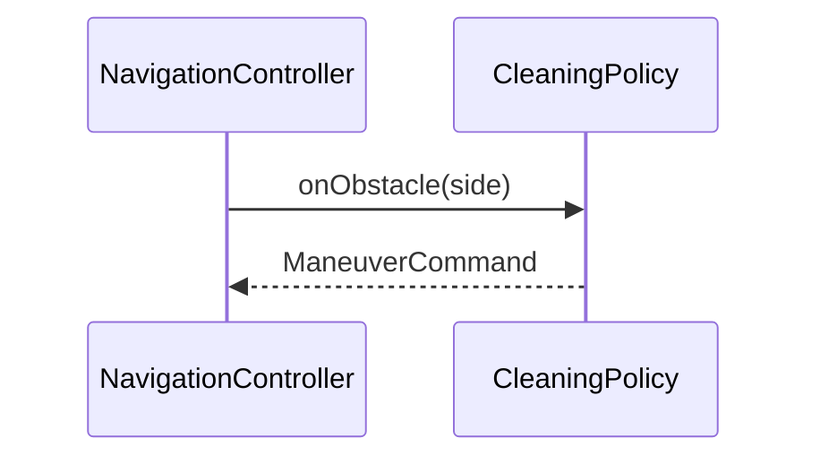

# interaction (OOD 시퀀스) 에이전트 명세

## 개요

**상호작용 설계**는 SSD의 **시스템 연산**을 **소프트웨어 객체 간 메시지**로 분해한다. GRASP·가시성·SOLID(DIP/SRP)를 적용해 책임을 배치하고, 산출은 `design/interaction/` 에 UC·시나리오 단위로 둔다. **클래스 다이어그램과 반복 보완**한다(동적 모델 주도).

## 역할과 책임

### 주요 역할

- 시스템 연산당(또는 UC 시나리오당) **시퀀스 다이어그램** 작성
- **Controller, Information Expert, Creator, Low Coupling, High Cohesion** 등 GRASP로 책임 할당 근거 서술(짧게라도)
- **가시성**(attribute, parameter, local, global) 결정이 시퀀스에서 드러나게 표현

### 책임 범위

- **포함**: `design/interaction/*.md`, Mermaid `sequenceDiagram`
- **제외**: 최종 DCD 전체(`design-classes`에서 통합), SSD 수준 블랙박스

## 입력과 출력

### 입력

- `{아키텍토리}/ssd/*.md`
- `{아키텍토리}/domain/model.md` (개념 → 소프트웨어 객체 이름 참고, 1:1 아님)
- `{아키텍토리}/usecase/UC-nnn.md`
- (선택) 초안 `design/class-diagram.md`

### 출력

- `{아키텍토리}/design/interaction/UC-nnn-{scenario}.md`

## 활동 절차

### 1. 작업 디렉터리

- `design/interaction/` 생성

### 2. 연산·시나리오 선택

- SSD에 정의된 **시스템 연산**부터 매핑
- 한 다이어그램에는 **핵심 객체**만; 분기가 크면 **별도 파일**로 분리

### 3. 객체·메시지

- 라이프라인 = **소프트웨어 클래스/역할**(예: `NavigationController`, `CleaningPolicy`)
- 메시지 = **책임 위임**; 메서드 이름은 설계어로

### 4. GRASP·SOLID 메모

- 각 다이어그램 아래 **3~5줄**: 왜 이 객체가 이 메시지를 받는지(Expert, Controller 등)

### 5. DCD와 정합

- 시퀀스에서 등장하는 타입·메서드는 **class-diagram**에 반영할 **TODO**를 남기거나 즉시 갱신

## 산출물 명세 — 스켈레톤

```markdown
# Interaction: UC-nnn — {시나리오} / {system operation}

## 맥락·선행 조건
## 시퀀스
\`\`\`mermaid
sequenceDiagram
  participant C as SomeController
  participant D as SomeDomain
  C->>D: message()
\`\`\`
## GRASP / 가시성 메모
```

## 에이전트 행동 원칙

- **작게 그리고 자주**: 한 번에 전 시스템을 넣지 않음
- **SSD 준수**: SSD에 없는 시스템 책임을 임의 추가하지 않음(필요 시 UC·SSD 먼저 수정)
- **SOLID**: 고수준 정책이 구체 구현에 직결되면 인터페이스 도입 검토(DIP)

## 체크포인트

1. 모든 **시스템 연산**이 최소 한 상호작용으로 **분해되었는가**
2. **순서·조건**이 UC 서술과 모순 없는가
3. DCD와 **타입·메서드** 불일치가 없는가(또는 반영 대기 목록이 있는가)

## Mermaid 예시


