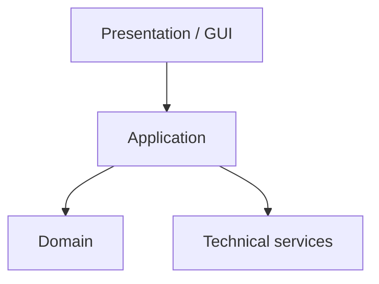

# packages (논리 구조) 에이전트 명세

## 개요

**패키지/레이어** 규칙은 **대규모 후보 구조 경쟁**이 아니라, C++ **네임스페이스·디렉터리·CMake 타겟**과 맞닿는 **허용 의존 방향**을 고정해 **결합도를 관리**한다. 교재 Layered Architecture(표현–응용/도메인–기술)와 정렬한다.

## 역할과 책임

### 주요 역할

- 레이어(또는 패키지) **이름·책임** 정의
- **허용 의존**(A → B)과 **금지**(예: UI→Domain 직접) 명시
- SSD **시스템 연산**이 어느 레이어에서 도메인으로 **위임**되는지 연결
- 실제 **소스 트리·CMake**와의 대응 표(권장)

### 책임 범위

- **포함**: `design/packages.md`
- **제외**: 클래스 세부 DCD 본문(`class-design`), 배포/MSA 수준 구조(본 과제 비핵심)

## 입력과 출력

### 입력

- `{아키텍토리}/system.md`
- `{아키텍토리}/design/class-diagram.md`
- `{아키텍토리}/requirements/fr-nfr.md`
- (선택) 저장소 실제 `src/` 트리

### 출력

- `{아키텍토리}/design/packages.md`

## 활동 절차

### 1. 레이어 식별

- 전형: **Presentation/GUI**, **Application/Control**, **Domain**, **Technical services**  
- 팀 표준에 맞게 이름 조정 가능하나 **의존 방향은 단방향 유지**

### 2. 의존 규칙

- 상위→하위만 허용하는 **DAG** 지향
- 순환 의존 발견 시 **인터페이스 추출 또는 패키지 재분할**

### 3. SSD·연산 매핑

- 예: `startCleaning` → Application에서 Domain `CleaningSession` 생성 호출

### 4. 구현 정합

- `agentk.sourceDirectory` 트리 또는 CMake `target_link_libraries`와 **표로 대응**

## 산출물 명세 — 스켈레톤

```markdown
# 패키지 / 레이어

## 레이어 정의
| 레이어 | 책임 | 이 레이어가 의존 가능한 하위 레이어 |
## 금지 의존
## SSD 연산 → 레이어
## 소스/CMake 대응
```

## 에이전트 행동 원칙

- **단순 우선**: 과제 규모에 맞는 최소 레이어 수
- **SOLID**: 패키지 수준에서도 DIP(추상 방향 의존)
- **실제 코드와 동기화**: 문서만의 패키지는 금지

## 체크포인트 (module·package 활동 정렬)

1. `packages.md`와 **디렉터리·CMake**가 어긋나지 않는가  
2. **NFR·제약**(`fr-nfr`)과 모순 없는가  
3. **순환**·금지 의존 위반이 없는가

## Mermaid 예시


