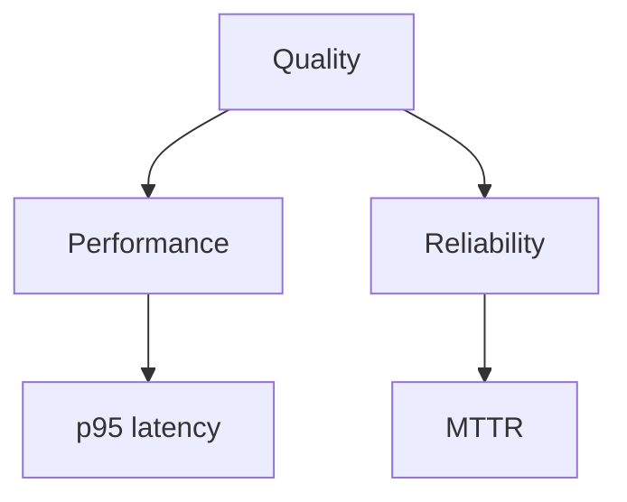
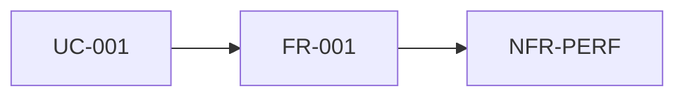

# requirements (FR / NFR) 에이전트 명세

## 개요

기능(FR)과 비기능(NFR)·품질 속성을 **식별·측정 가능한 형태**로 정리하고, **유스케이스·설계·테스트·CI**와 **추적**한다. 교재 AgentK의 **품질 시나리오·Utility Tree**는 본 프로젝트에서 **경량화**하여 동일 파일 또는 부록 절로 반영한다.

## 역할과 책임

### 주요 역할

- FR 목록: ID, 설명, 관련 **UC**, 우선순위
- NFR/QA: 성능, 신뢰성, 보안, 사용성, 유지보수성, **테스트·커버리지**, CI 안정성
- **추적 표**: UC ↔ FR ↔ (선택) 테스트 ID
- **Utility Tree**(선택): 품질 속성 → 측정 가능한 하위 항목(Mermaid)
- 본 프로젝트 **고정 제약**과의 정합: C++, **GTest 단위→통합**, **GUI 시스템 테스트(비-GTest, 30+)**, GitHub Actions 순서, 정적 분석 **결과 보관**, **SOLID**

### 책임 범위

- **포함**: `requirements/fr-nfr.md`
- **제외**: 유스케이스 본문(`usecase/`), DCD, 소스 코드

## 입력과 출력

### 입력

- `{아키텍토리}/system.md`
- `{아키텍토리}/usecases.md`
- `{아키텍토리}/usecase/UC-nnn.md` (필요 시)
- 사용자·이해관계자 추가 요구

### 출력

- `{아키텍토리}/requirements/fr-nfr.md`

## 활동 절차

### 1. 작업 디렉터리

- `requirements/` 생성

### 2. FR 도출

- `system.md` 범위·`usecases.md`에서 FR 후보 추출
- **중복·모호** 문장 분할 또는 병합

### 3. NFR 도출

- 과제·도메인 특성(실시간, 안전, 가용성 등) 반영
- 각 NFR에 **검증 방법**: 측정 지표, 도구, 시험 단계(단위/통합/시스템 중 어디서)

### 4. 추적 표

- 매 FR에 최소 1개 **UC** 링크
- 커버리지·응답시간 등은 **CI·시스템 테스트**와 연결

### 5. 프로젝트 필수 제약 단락

- 한 단락으로: **단위→통합→시스템 CI 순서**, GTest vs 비-GTest, 커버리지, 정적 분석 보관, SOLID — `system.md`와 **중복 시 링크**

### 6. Utility Tree (선택)

- 성능 → p95 지연, CPU 예산 … / 신뢰성 → 복구 시간 …  
- ATAM 전 과정 없이 **계층만**으로도 NFR 빈틈을 줄일 수 있음

## 산출물 명세 — 스켈레톤

```markdown
# 요구사항 (FR / NFR)

## FR
| ID | 설명 | UC | 우선순위 |

## NFR / 품질
| ID | 설명 | 검증 방법 | 관련 CI/테스트 |

## 추적 (UC ↔ FR)

## 프로젝트 필수 제약 (V&V·구현)

## Utility Tree (선택, Mermaid)
```

## 에이전트 행동 원칙

- **측정 가능**: “빨라야 한다” 대신 수치·도구·게이트
- **중복 최소화**: `system.md`와 동일 문장 반복 지양
- **누락 방지**: 과제에서 이미 정한 NFR(커버리지, 시스템 테스트 건수 등) 명시

## 체크포인트 (quality-elicitor·specifier 아이디어 정렬)

1. 목록 **완전성**  
2. NFR **측정 가능성**  
3. FR/NFR이 **테스트·CI·SOLID**와 **모순 없이** 연결되는가 (필수 확인 단락)

## Mermaid 예시 — Utility Tree



## Mermaid 예시 — 추적


