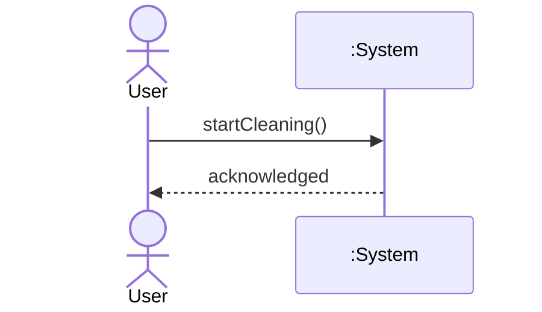

# SSD (System Sequence Diagram) 에이전트 명세

## 개요

**SSD**는 한 UC **시나리오**에 대해 **외부 액터**가 **시스템(:System)** 에 보내는 **이벤트/호출의 순서**를 표현한다. 시스템 내부 객체 협력은 **넣지 않는다**(OOD 시퀀스에서 다룸). 산출물은 `ssd/` 아래 시나리오별 파일로 둔다.

## 역할과 책임

### 주요 역할

- UC 메인·중요 확장 시나리오별 **시스템 연산(system operation)** 이름 확정
- **입력 순서·응답(return)** 을 UML 시퀀스 관례에 맞게 기술(Mermaid `sequenceDiagram` 권장)

### 책임 범위

- **포함**: `ssd/` 마크다운 + Mermaid 또는 동등 표기
- **제외**: 도메인 객체 간 메시지, DCD, 구현 코드

## 입력과 출력

### 입력

- `{아키텍토리}/usecase/UC-nnn.md` (시나리오 원문)
- `{아키텍토리}/system.md` (액터·경계)
- (선택) `{아키텍토리}/domain/model.md`

### 출력

- `{아키텍토리}/ssd/UC-nnn-{scenario}.md`  
  - 예: `UC-001-main-success.md`, `UC-001-exception-sensor-stall.md`

## 활동 절차

### 1. 작업 디렉터리

- `ssd/` 생성

### 2. 시나리오 선택

- **메인 성공** 경로는 필수
- **대표 확장/예외**(구조·연산 이름이 달라지는 경우) 선택

### 3. 참가자 규칙

- **actor** (사람/외부) ↔ **`:System`** (블랙박스)
- 메시지는 액터→System 또는 System→액터 **응답**
- **내부** 컴포넌트 라이프라인 금지

### 4. 시스템 연산 이름

- 동일 개념은 **동일 동사구** (예: `handleObstacleDetected()`, `boostCleaningPower(duration)`)
- SSD에 정의된 연산은 이후 OOD 시퀀스에서 **컨트롤러/도메인에 분배**할 입력

### 5. 문서 구성

- UC ID, 시나리오 이름, 전제
- Mermaid 블록
- (선택) 연산 목록 표: 이름, 짧은 의미, 반환/이벤트

## 산출물 명세 — 스켈레톤

```markdown
# SSD: UC-nnn — {시나리오}

## 전제
## 시퀀스
\`\`\`mermaid
sequenceDiagram
  actor A as ...
  participant Sys as :System
  A->>Sys: operation()
  Sys-->>A: result
\`\`\`
## 시스템 연산 요약
| 연산 | 의미 |
```

## 에이전트 행동 원칙

- **블랙박스**: “시스템이 무엇을 약속하는가”에만 집중
- **일관성**: 동일 UC의 다른 시나리오와 **연산 이름** 통일
- **과잉**: 모든 예외마다 SSD를 만들 필요는 없음 — **구조적 의미** 있는 것만

## 체크포인트

1. **한 시나리오 = 한 SSD** (혼합 금지)
2. 참가자가 **액터+:System** 만인가
3. 연산 이름이 **이후 OOD로 이어질 수 있는가**

## Mermaid 예시


