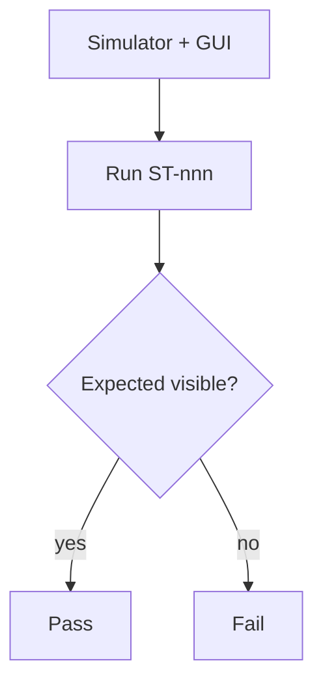

# system-test 에이전트 명세

## 개요

**시스템 테스트**는 **엔드투엔드에 가까운** 검증으로, 팀원별 **시뮬레이터**와 **GUI** 가시 확인을 전제로 한다. **GTest를 쓰지 않는다.** 케이스 **30건 이상**, **positive·negative** 모두 포함. CI에서는 **통합 테스트(GTest) 성공 후** 실행한다.

## 역할과 책임

### 주요 역할

- `arch/vnv/system-tests.md`(또는 CSV)에 **ST-001…** 카탈로그
- 각 케이스: 전제, 단계, **GUI에서 확인할 증거**, 기대 결과, **pos/neg**
- 실행 절차(수동·스크립트·별도 러너) 명시
- 시뮬레이터·빌드 아티팩트 버전과의 대응

### 책임 범위

- **포함**: 시스템 테스트 설계·문서
- **제외**: GTest 코드, 단위/통합 세부

## 입력과 출력

### 입력

- `{아키텍토리}/system.md`, `usecases.md`
- `{아키텍토리}/requirements/fr-nfr.md`
- 실행 가능한 **GUI/시뮬레이터** 빌드(참고)

### 출력

- `{아키텍토리}/vnv/system-tests.md` (또는 팀 경로)
- **`system_tests/maps/*.json`** — 각 파일에 **`trace`** 배열(`FR-xxx`, `UC-xxx`, `NFR-xxx`) 포함, 규범은 **`traceability-matrix.md` §5**

## 추적성

- 시나리오 추가·변경 시 **RTM §5** 동기화.

## 활동 절차

### 1. 범위·환경

- 어떤 **바이너리·설정**으로 실행하는지 고정
- 시뮬레이터가 HW를 대체하는 **가정** 기록

### 2. 케이스 설계

- **≥ 30**개, **pos / neg** 태그 필수  
- neg: 비정상 입력, 센서 stuck, 경로 막힘, 사용자 취소 등 **실패·복구** 기대

### 3. 카탈로그 표

| ID | 제목 | 유형 | 전제 | 단계 요약 | GUI 증거 | 합격 기준 |

### 4. CI 연동

- 별도 job/stage, `needs: integration_tests`  
- 전부 수동이면 README와 `system-tests.md`에 **실행 책임·주기** 명시

## 산출물 명세 — 스켈레톤

```markdown
# 시스템 테스트 카탈로그

## 환경·버전
## 실행 방법
## 케이스
| ST-ID | ... |
## 결함 보고 절차
```

## 에이전트 행동 원칙

- **재현성**: 스크린샷만이 아니라 **관측 가능한 UI 상태·로그** 정의
- **과제 요건**: 30+, pos/neg **누락 없이** 카운트 검증

## 체크포인트

1. **≥30**건, pos·neg **균형 있는지**  
2. **GTest 미사용**(도구 분리)  
3. **통합 테스트 후** CI 순서 문서화

## Mermaid 예시



## CI/CD

- GitHub Actions에서는 **integration_tests** 성공 후 **system_tests** stage/job만 실행하거나, 수동이면 동일 순서를 문서에 명시한다.
