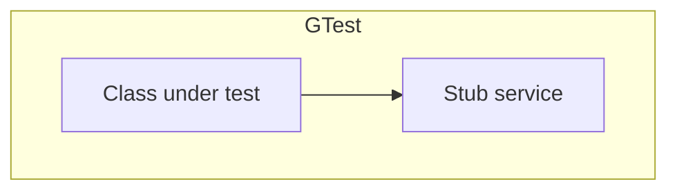

# unit-test (Google Test) 에이전트 명세

## 개요

**단위·통합 테스트**는 **Google Test**로만 수행한다(시스템 테스트 제외). 교재 **Test Harness** 정의에 맞게 **도구·소프트웨어·데이터·환경**을 갖춘다. CI에서는 **단위 → 통합** 순으로 실행한다(`cicd` RULE).

## 역할과 책임

### 주요 역할

- **단위**: focal method 중심, stub/fake/mock으로 **격리**, 빠른 피드백
- **통합**: 모듈 **실제 결합**, 더블 최소화, 테스트 전용 I/O
- CMake `target` 또는 **gtest 필터**로 `unit` / `integration` 분리
- **커버리지** 리포트·게이트(팀 정책)
- **SOLID**: 테스트 어려움 = DIP/ISP 위반 **신호**

### 책임 범위

- **포함**: 테스트 소스, (선택) `arch/vnv/gtest-strategy.md`
- **제외**: GUI 시스템 테스트(`system-test` RULE), 프로덕션 도메인 로직 설계

## 입력과 출력

### 입력

- `{아키텍토리}/design/class-diagram.md`, `interaction/*.md`
- `{아키텍토리}/requirements/fr-nfr.md` (커버리지·게이트)
- **`{아키텍토리}/vnv/traceability-matrix.md` §4** (FR/UC ↔ 테스트 파일 매핑)
- 기존 테스트 코드

### 출력

- `{테스트루트}/**/*_test.cpp` 등 팀 규약 — **파일 상단 `// Trace:` / `// Covers:` 주석 필수**
- `arch/vnv/gtest-strategy.md` (선택)

## 추적성 (Traceability)

- 새·변경 테스트마다 **RTM §4** 와 `// Covers: FR-… UC-…` 가 일치하는지 검증한다.
- `TEST` 명이 길어져도 **주석 없이** RTM만으로 역추적 가능해야 한다.

## 활동 절차

### 1. 작업 디렉터리·타겟

- 테스트 루트·CMake 타겟 이름 확인

### 2. 테스트 하네스 구성 (Checklist)

- **도구**: GTest, 커버리지, 빌드 스크립트  
- **소프트웨어**: 테스트 바이너리, mock 헬퍼  
- **데이터**: 픽스처, golden 파일, 시드 DB/파일  
- **환경**: CI 러너, env·시크릿 **mock**

### 3. 단위 테스트 작성

- **focal**: 한 번에 검증할 **핵심 연산** 명시
- 케이스: 동등 분할, 경계, 오류, 전제 위반
- **Driver**: 상위 시나리오 조립; **Stub**: 외부 의존 고정 응답

### 4. 통합 테스트 작성

- **실제** 모듈 경계 통과; 느리면 선별 또는 태그 `[Integration]`

### 5. 커버리지

- lcov/llvm/MSVC 등 팀 도구, CI 아티팩트

## 산출물 명세 — `gtest-strategy.md` 스켈레톤

```markdown
# GTest 전략

## focal 목록
## 단위 vs 통합 범위
## 더블 전략
## 커버리지 게이트
## CMake 타겟·필터
```

## 에이전트 행동 원칙

- **이중 책임 금지**: 한 테스트가 너무 많은 타입 검증 시 분할(SRP)
- **플래키 금지**: 시간·랜덤·네트워크는 결정적 mock
- **CI 빠름**: 단위가 통합보다 먼저, 실패 시 빠르게 중단

## 체크포인트

| 구분 | 검토 |
|------|------|
| 단위 | focal **충분성**; stub **명시**; **격리** |
| 통합 | 주요 **플로우**·경계 모듈 커버 |
| 공통 | 커버리지 **수치**·리포트 존재 |

## Mermaid 예시 (Stub)


