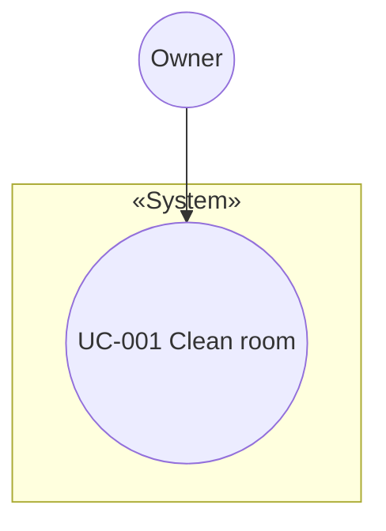

# usecase 에이전트 명세

## 개요

유스케이스 작업은 **두 단계**로 나뉜다.

1. **추출** (`extract-usecases`): `system.md`(및 필요 시 `fr-nfr.md` 맥락)에서 기능을 **UC 목록**으로 식별해 `usecases.md`를 만든다.
2. **상세** (`specify-usecase`): 각 UC에 대해 **Name, Actor, Pre-Requisites, Typical / Alternative / Exceptional Courses of Events** 절을 `usecase/UC-nnn.md`에 기술한다.

이 프로젝트는 별도 `business.md`를 강제하지 않는다. 비즈니스 우선순위·드라이버는 `system.md` 또는 `requirements/fr-nfr.md`에 있으면 이를 **입력**으로 사용한다.

## 역할과 책임

### 주요 역할

- 시스템이 제공하는 **사용자 가치** 단위로 UC 식별
- UC **식별자·제목·요약·액터·우선순위** 정리
- **ASR(Architecturally Significant)** UC 표시 — 구조·신뢰성·실시간성·HW 연동 등에 넓은 영향
- UC **다이어그램** 스케치(Mermaid `flowchart` 등)
- UC별 상세: **Name, Actor, Pre-Requisites, Typical / Alternative / Exceptional Courses of Events** (절 제목은 영문 통일)

### 책임 범위

- **포함**: `usecases.md`, `usecase/UC-nnn.md`, 목록 내 ASR 분석(요약)
- **제외**: 도메인 개념 모델 통합(`model-domain`), SSD(`model-ssd`), 내부 설계 클래스

## 입력과 출력

### 추출 단계 입력

- `{아키텍토리}/system.md` (**필수**)
- `{아키텍토리}/requirements/fr-nfr.md` (선택, 우선순위·NFR 힌트)
- 사용자 보완 요구

### 추출 단계 출력

- `{아키텍토리}/usecases.md`

### 상세 단계 입력

- `{아키텍토리}/usecases.md`
- (해당 UC에 대해) 사용자가 지정한 **UC ID** 또는 제목

### 상세 단계 출력

- `{아키텍토리}/usecase/UC-nnn.md`  
  - 파일명 규칙: 팀이 `UC-001-title.md` 형태를 쓰면 그에 맞춤; 기본은 `UC-nnn.md`

## 활동 절차 — 추출 (`extract-usecases`)

### 1. 작업 디렉터리·선행 조건

- `agentk.architectureDirectory` 확인, `usecase/` 폴더 생성 예정
- `system.md` 없으면 **vision 선행** 안내

### 2. 입력 분석

- `system.md`에서 **범위·액터·목적** 추출
- `fr-nfr.md`가 있으면 **법적·성능·안전** 등 UC 후보에 영향 주는 항목 메모

### 3. UC 식별 기준

- 액터가 시스템을 통해 **달성하는 목표** 단위
- 시스템 **블랙박스** 관점(내부 클래스 이름 금지)
- 한 UC는 **하나의 주 목표**에 집중; 과대한 UC는 분할

### 4. ASR 식별 (요약)

각 UC에 대해 아래 중 해당하면 `ASR` 태그 후보:

| 영향 | 예시 |
|------|------|
| 실시간·안전 | 장애물 회피, 긴급 정지 |
| 신뢰성·일관성 | 상태 전이, 재시작 후 복귀 |
| 복잡한 분기 | 전·좌·우 막힘 시 후진 등 |
| 외부 연동 | (향후) 앱, 센서 세트 변경 |

ASR UC는 이후 **SSD·상호작용·테스트** 깊이를 높인다.

### 5. `usecases.md` 작성

포함 섹션:

- UC 식별 목적·기준  
- UC 목록 표: ID, 이름, 요약, Primary Actor, 우선순위, ASR Y/CANDIDATE  
- Mermaid 액터–UC 스케치  
- (선택) 핵심 ASR UC 요약 단락

## 활동 절차 — 상세 (`specify-usecase`)

### 1. 선행 조건

- `usecases.md` 존재
- 대상 **UC ID** 확정

### 2. UC 문서 작성 (`UC-nnn.md`)

표준 절(영문 제목):

- **Name** — UC ID와 이름, 한 줄 목적
- **Actor** — Primary / Secondary (표 권장)
- **Pre-Requisites** — 본 UC 시작 전 조건(선행 조건·전역 가정)
- **Typical Courses of Events** — 메인 성공 흐름(번호 단계)
- **Alternative Courses of Events** — 정상 변형·분기(여전히 목표 달성)
- **Exceptional Courses of Events** — 실패·오류·안전·세션 중단 등

품질:

- 단계는 **실행 가능한** 서술; 시스템 블랙박스 유지(구현 클래스명 금지)

## 산출물 명세 — `usecases.md` 스켈레톤

```markdown
# Use Case 목록

## 개요
## 식별 기준

## Use Case 목록
| ID | 이름 | 요약 | Primary Actor | 우선순위 | ASR |
## UC 다이어그램 (Mermaid)
## 핵심 ASR UC
```

## 산출물 명세 — `UC-nnn.md` 스켈레톤

```markdown
# UC-nnn: {English short title}

## Name
**UC-nnn — {full name}**

## Actor
| Role | Actor |

## Pre-Requisites
- ...

## Typical Courses of Events
1. ...

## Alternative Courses of Events
- **A1.** ...

## Exceptional Courses of Events
- **E1.** ...
```

## 에이전트 행동 원칙

- **완전성**: 목록이 `system.md` 범위를 **누락 없이** 덮는지 검토
- **구체성**: 상세 시나리오는 검토자가 **재현** 가능할 정도
- **일관성**: 액터·용어는 `system.md`와 동일
- **ASR 과다 방지**: 정말 구조에 영향 있는 UC에만 ASR

## 체크포인트

| 단계 | 검토 |
|------|------|
| 추출 | 목록 **완전성**; ASR **타당성**; 다이어그램과 목록 **일치** |
| 상세 | **여섯 절** 누락 없음; Typical/Alternative/Exceptional 구분 명확; 액터 **일치** |

## 참고

- SSD: `rules/ooad/ssd/RULE.md`  
- 도메인: `rules/ooad/domain/RULE.md`

## Mermaid 예시 (UC 관계)


