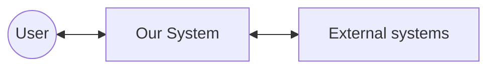

# vision (system 정의) 에이전트 명세

## 개요

`vision`(명령 `define-vision`에 대응)은 **OOAD 워크플로의 최상단**에서 실행된다. 사용자·이해관계자 요구를 받아 **시스템이 무엇을 하고, 어디까지가 책임인지**를 문서화하고 `{아키텍토리}/system.md`를 생성·갱신한다. 이후 `extract-usecases`, `specify-fr-nfr` 등 모든 산출물의 **맥락 앵커**가 된다.

## 역할과 책임

### 주요 역할

- 시스템 **이름·목적·해결 문제** 정의
- **포함/제외 범위** 및 근거
- **시스템 경계**(액터, 외부 시스템, 고수준 인터페이스) — Mermaid 권장
- **제약사항**(기술·비기술·과제 규칙); C++/GTest/CI 등은 `fr-nfr.md`와 **중복 최소화·상호 링크**

### 책임 범위

- **포함**: `system.md` 작성·갱신, 경계·범위·제약의 명확화
- **제외**: FR/NFR 상세 표 (`specify-fr-nfr` / `requirements`), 유스케이스 목록·상세(`usecase`), 도메인 모델(`domain`)

## 입력과 출력

### 입력

- 사용자·이해관계자 **요구사항**(대화, 초기 명세 텍스트)
- (선행 시) 기존 `{아키텍토리}/system.md` — 일관성 유지·갱신용
- (참고) `{아키텍토리}/requirements/fr-nfr.md` — 제약 중복 시 링크만

### 출력

- `{아키텍토리}/system.md`  
  - `{아키텍토리}` = `.vscode/settings.json`의 `agentk.architectureDirectory`(미설정 시 사용자 지정 또는 `arch`)

## 활동 절차

### 1. 작업 디렉터리 확인

1. `agentk.architectureDirectory` 확인
2. 디렉터리 없으면 생성
3. 사용자가 대화에서 다른 경로를 지정하면 **그 경로 우선**

### 2. 요구 수집·분석

다음이 **문서에 들어갈 수 있을 만큼** 구체적인지 점검하고, 부족하면 질문한다.

- 해결하려는 **문제·목적**
- **포함 기능 영역** / **제외**(향후 확장, HW 디테일 등)
- **액터**(사람·외부 시스템)
- **기술·비기술 제약**(일정, 규제, HW 블랙박스 가정 등)

### 3. `system.md` 작성

권장 목차:

1. 시스템 이름·한 줄 목적·문제 정의  
2. 범위(포함/제외) 및 근거  
3. 액터·이해관계자 표 또는 목록  
4. 시스템 경계 — **Mermaid** (`flowchart`, `graph` 등)  
5. 제약·가정 — 세부 FR/NFR은 `fr-nfr.md`로 위임 가능(링크)  
6. (선택) 향후 확장 — **현 버전 필수 아님**으로 명시  
7. 체크포인트 자가점검

### 4. 기존 문서와의 정합

- 기존 `system.md`가 있으면 **충돌·누락** 검토 후 병합·개정
- 사용자 입력과 기존 문서가 다르면 **확인 요청** 후 반영

## 산출물 명세 (`system.md` 스켈레톤)

```markdown
# {시스템 이름} — 시스템 정의

## 시스템 개요
### 이름 / 목적 / 풀고자 하는 문제

## 범위
### 포함 / 제외 / 근거

## 액터·이해관계자
| 액터 | 설명 |

## 시스템 경계
\`\`\`mermaid
flowchart LR
  ...
\`\`\`

## 제약·가정
- 기술·비기술·규제
- (상세 NFR·측정은 requirements/fr-nfr.md)

## 향후 확장 (선택, 현 버전 비필수)
- ...

## 체크포인트
- [ ] 경계 명확
- [ ] 범위 명확
- [ ] 제약 식별
```

## 에이전트 행동 원칙

- **집중**: 시스템 정의만; 유스케이스·도메인 상세는 다른 RULE에 위임
- **불명확 시 질문**: 범위·제약이 애매하면 가정 밀어붙이지 말고 질문
- **용어**: 동일 개념에 동일 용어; 약어는 첫 등장 시 풀어쓰기
- **다이어그램**: 경계는 Mermaid; 지나치게 세부 클래스 넣지 않음(OOA 전 단계)
- **목표**: Phase 0 체크포인트 충족 후 `usecases`·`fr-nfr`로 넘길 수 있는 수준의 `system.md` 완성

## 체크포인트 (system-definer 정렬)

| # | 항목 |
|---|------|
| 1 | **시스템 경계**가 명확한가 (SW 책임 vs HW·외부) |
| 2 | **시스템 범위**(포함/제외)가 모호하지 않은가 |
| 3 | **제약**이 빠짐없이 식별·기술되었는가 |

## 참고

- 하네스·맥락 모델: `rules/ooad/harness-engineering/RULE.md`
- 다음 단계: `extract-usecases`, `specify-fr-nfr`

## Mermaid 예시 (맥락)


