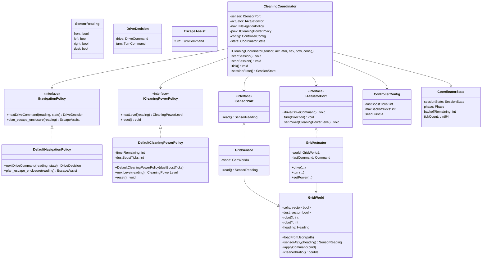

# 설계 클래스 다이어그램 (DCD) — RVC Cleaning Controller

## 개요

본 DCD는 OOA 산출물(usecases, ssd, domain) + OOD 상호작용에서 식별된 **클래스·인터페이스·연산 시그니처**의 정적 청사진이다. 알고리즘 본문은 코드(`src/`)로 위임한다.

## Mermaid classDiagram



## 인터페이스·구현 관계

| Interface | Default impl | Where used |
|-----------|--------------|------------|
| `ISensorPort` | `GridSensor` (technical), `MockSensor` (tests) | Coordinator attribute. |
| `IActuatorPort` | `GridActuator` (technical), `MockActuator` (tests) | Coordinator attribute. |
| `INavigationPolicy` | `DefaultNavigationPolicy` | Coordinator attribute. |
| `ICleaningPowerPolicy` | `DefaultCleaningPowerPolicy` | Coordinator attribute. |

## 핵심 enums / value types

```cpp
enum class DriveCommand { Stop, Forward, Backward };
enum class TurnCommand { None, Left, Right };
enum class Direction { Left, Right };          // resolved direction (no None)
enum class CleaningPowerLevel { Off, Nominal, Boosted };
enum class SessionState { Stopped, Running };
enum class Phase { Driving, Avoiding, Escaping };
```

## SOLID 점검 메모

- **SRP**: Coordinator(상태 전이·오케스트레이션) ↔ NavigationPolicy(주행 결정) ↔ CleaningPowerPolicy(파워/타이머) ↔ Grid* (기술 어댑터). 변경 이유가 각각 다르다.
- **OCP**: 새 정책(예: RightFirstNavigationPolicy)을 인터페이스 구현체로 추가해도 Coordinator 수정 없이 주입 가능.
- **LSP**: 모든 정책/포트 구현은 “예외 던지지 않음 + 결정적 반환”의 약속을 지킨다. 테스트에서 mock으로 대체해도 의미가 보존됨.
- **ISP**: 센서·액추에이터 포트가 분리. 정책별 인터페이스도 navigation/power 두 갈래로 분리.
- **DIP**: Coordinator는 어떤 구체 어댑터도 import하지 않는다(헤더 의존만 추상). Grid/Mock 구현체는 의존성 주입(DI)으로 결합.

## 가시성 (요약)

| 멤버 | 가시성 | 근거 |
|------|--------|------|
| Coordinator의 정책/포트 | private attribute (생성자 주입) | DIP |
| `CoordinatorState` | private attribute (외부에서 직접 변경 금지) | SRP |
| `tick()` `startSession()` `stopSession()` `sessionState()` | public | UC-001 진입점 |
| `DefaultCleaningPowerPolicy::timerRemaining` | private | 캡슐화 |
| `GridWorld::cells/dust` | private (read-only views via methods) | 캡슐화 |
