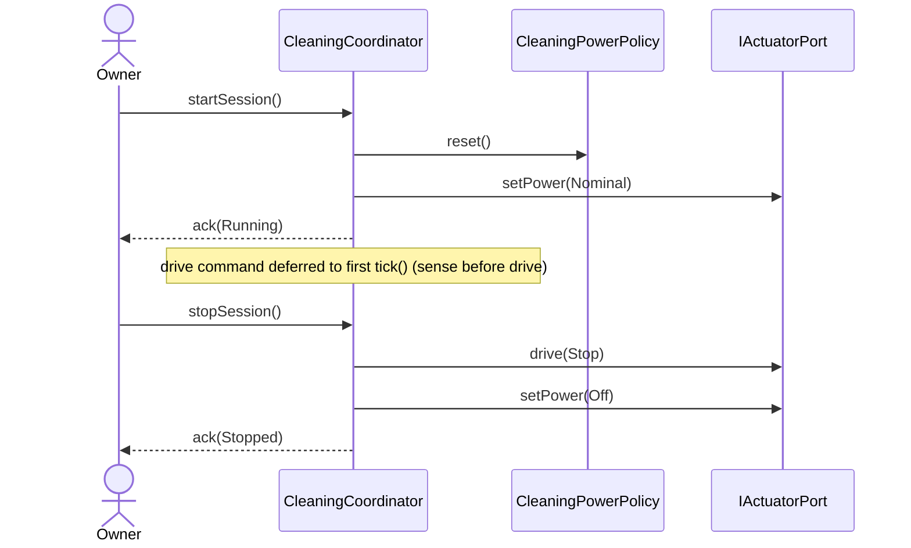

# Interaction: UC-001 — startSession() / stopSession()

## 맥락·선행 조건

- Owner가 컨트롤러의 진입점(`CleaningCoordinator`)에 세션 시작·정지를 직접 호출한다.
- `CleaningCoordinator`는 두 정책(`NavigationPolicy`, `CleaningPowerPolicy`)과 두 포트(`ISensorPort`, `IActuatorPort`)에만 의존한다(DIP).

## 시퀀스

## GRASP / 가시성 메모

- **Controller (GRASP)**: `CleaningCoordinator`가 시스템 연산의 진입점을 단독 소유한다. UC 분기·세션 상태도 여기서 관리(SRP는 “tick 결정”에 묶여 있고, 상태 전이는 동일 책임 영역).
- **Low Coupling**: Coordinator는 `IActuatorPort`만 사용. 액추에이터 구현체(`GridActuator`, `MockActuator`)는 모른다.
- **가시성**: `Pow` (CleaningPowerPolicy)는 Coordinator의 attribute. Act/Sense 포트도 attribute.
