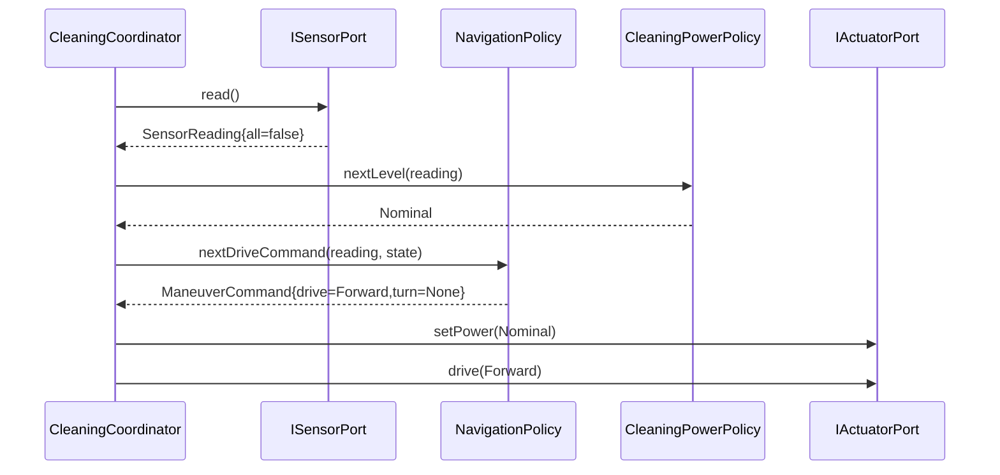

# Interaction: UC-002 — tick() (forward cleaning, no obstacle)

## 맥락·선행 조건

- 세션 Running. 모든 센서 false.

## 시퀀스

## GRASP / 가시성 메모

- **Information Expert**: `NavigationPolicy`가 SensorReading + 직전 상태를 보고 다음 ManeuverCommand 결정.
- **High Cohesion**: `CleaningPowerPolicy`는 파워만, `NavigationPolicy`는 주행만(SRP).
- **Pure Fabrication**: 두 정책 모두 도메인 명사가 아니지만 결정 로직을 응집시켜 SRP를 지원.
