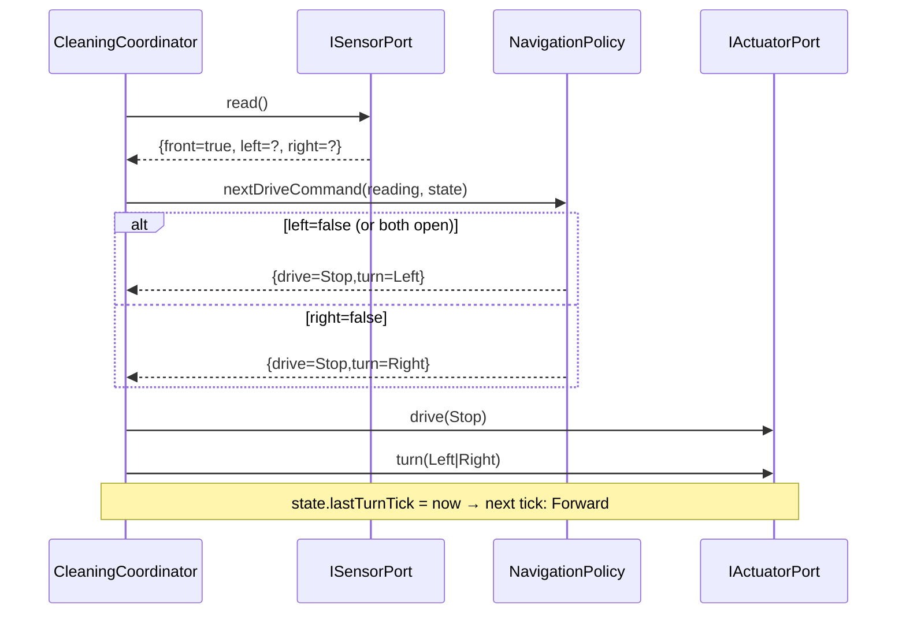

# Interaction: UC-003 — tick() (partial obstacle)

## 맥락·선행 조건

- 세션 Running. `front=true`, 좌·우 중 ≥1쪽 열림.

## 시퀀스

## GRASP / 가시성 메모

- **Polymorphism (OCP)**: `NavigationPolicy`가 인터페이스/추상이면 다른 deterministic 정책(예: 우측 우선)을 OCP로 갈아끼울 수 있다. 본 프로젝트는 `DefaultNavigationPolicy`만 제공.
- **Deterministic**: 양쪽 열림 분기에서 항상 Left 우선(FR-003).
