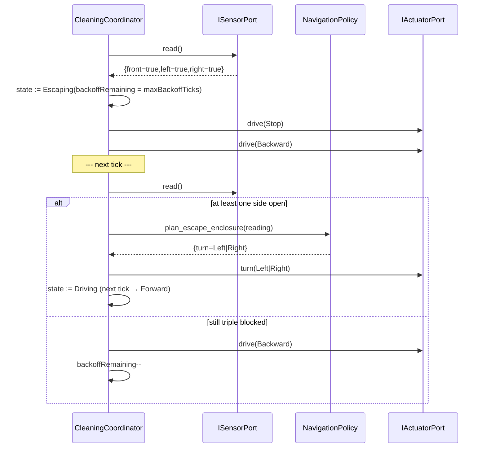

# Interaction: UC-004 — tick() (triple-blocked enclosure escape)

## 맥락·선행 조건

- 세션 Running. `front=true && left=true && right=true`.
- 단계 전이는 Coordinator가 단일 오케스트레이션으로 소유한다(`reproducibility` RULE §3).

## 시퀀스

## GRASP / 가시성 메모

- **Controller**: 후진 → 회전 → 전진의 단계 전이는 `CleaningCoordinator` 가 소유(SSoT).
- **Pure Fabrication**: `NavigationPolicy::plan_escape_enclosure`는 보조 helper(스텁/정책 보조). 코디네이터 전체 시퀀스를 대체하지 않는다.
- **Safety**: `backoffRemaining` 0 도달 시 `drive(Stop)` + 다음 tick 재시도(또는 향후 owner notify).
