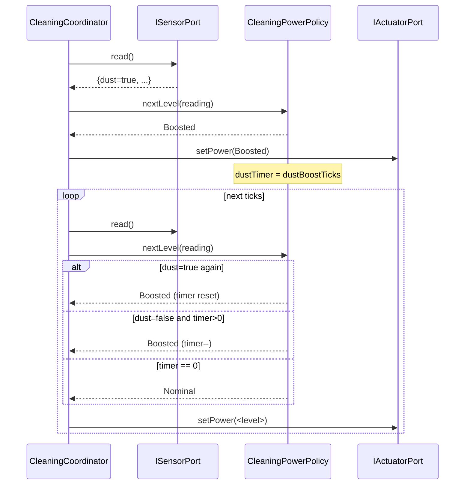

# Interaction: UC-005 — tick() (dust boost)

## 맥락·선행 조건

- 세션 Running. `dust=true` 한 tick 이상.

## 시퀀스

## GRASP / 가시성 메모

- **Information Expert**: `CleaningPowerPolicy`가 dust timer/state의 단일 소유자(SRP).
- **OCP**: 부스트 정책 변경(예: 두 단계 부스트, Boost → Auto)은 `CleaningPowerPolicy` 교체로 대응.
