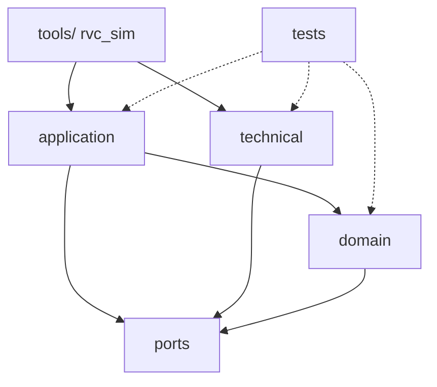

# 패키지 / 레이어 — RVC Cleaning Controller

## 레이어 정의

| 레이어 | 책임 | 의존 가능한 하위 레이어 |
|--------|------|-------------------------|
| `tools/` (Presentation) | `rvc_sim` 헤드리스 진입점, JSON 시나리오 로드/실행, ASCII 렌더(선택). | `application`, `technical`, `domain` |
| `application` (`rvc::app`) | `CleaningCoordinator` — UC 진입점/상태 전이/오케스트레이션. | `domain`, `ports` |
| `domain` (`rvc::domain`) | 정책(`NavigationPolicy`, `CleaningPowerPolicy`)과 value types(`SensorReading`, `DriveDecision`, enums). | `ports` (값 타입만) |
| `ports` (`rvc::ports`) | `ISensorPort`, `IActuatorPort` 추상 인터페이스. value types. | (없음) |
| `technical` (`rvc::tech`) | `GridWorld`, `GridSensor`, `GridActuator`, JSON 파서. | `ports` |
| `tests/` | GTest unit/integration. | 모두(테스트만 cross-cutting). |

## 금지 의존

- `domain` → `technical` **금지** (정책은 격자나 JSON을 모른다).
- `ports` → `domain`/`application` **금지** (포트는 도메인 값만 알고 정책은 모른다).
- `application` → `technical` **금지**: Coordinator는 어댑터를 직접 import하지 않는다(DI로 주입).
- `tools/` 가 `domain` 정책 구체 클래스를 우회 사용 가능하나, Coordinator 생성·DI 조립은 한 곳에서 한다.

## SSD 연산 → 레이어

| SSD 연산 | 시작 레이어 | 위임 경로 |
|----------|-------------|-----------|
| `startSession()` | `application` | Coordinator → IActuatorPort.setPower/drive |
| `stopSession()` | `application` | Coordinator → IActuatorPort.drive(Stop)/setPower(Off) |
| `tick()` | `application` | Coordinator → ISensorPort.read → domain policies → IActuatorPort.* |

## 소스 / CMake 대응

| 폴더 | CMake target | 비고 |
|------|--------------|------|
| `include/rvc/ports/` | `rvc_ports` (INTERFACE) | 헤더 전용 |
| `include/rvc/domain/` + `src/domain/` | `rvc_domain` (STATIC) | 정책 구현 |
| `include/rvc/app/` + `src/app/` | `rvc_app` (STATIC) | Coordinator |
| `include/rvc/tech/` + `src/tech/` | `rvc_tech` (STATIC) | Grid* + JSON |
| `tools/rvc_sim.cpp` | `rvc_sim` (EXECUTABLE) | 시뮬 진입점 |
| `tests/unit/` | `rvc_unit_tests` (EXECUTABLE) | GTest 단위 |
| `tests/integration/` | `rvc_integration_tests` (EXECUTABLE) | GTest 통합 |

## Mermaid

## 체크포인트

1. `packages.md`와 디렉터리/CMake 일치(아래 “소스/CMake 대응” 표).
2. 순환 의존 없음(DAG).
3. NFR-MAINT-001(SOLID/DIP)와 모순 없음.
