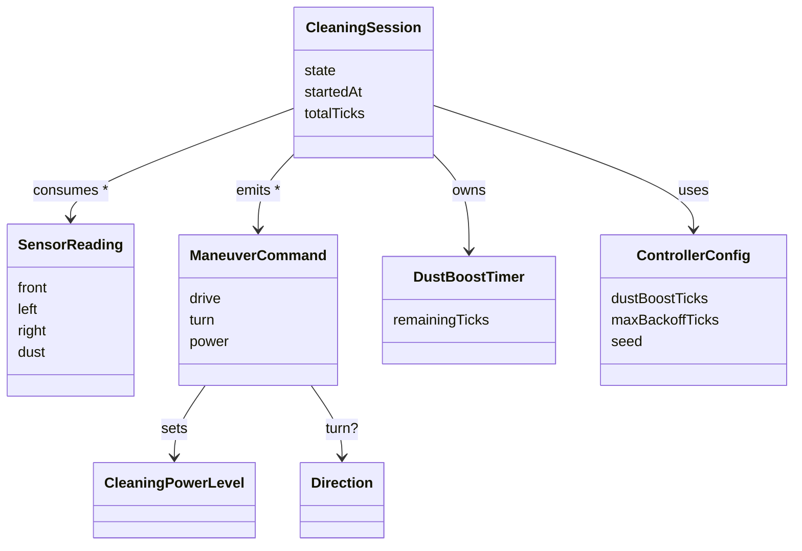

# 도메인 모델 (개념적) — RVC Cleaning Controller

## 개요 / 용어

본 모델은 OOA 단계 산출물로 **개념 클래스**와 **연관**만 정의한다. 구현 타입·프레임워크 마법은 DCD(`design/class-diagram.md`)에서 다룬다.

| 용어 | 정의 |
|------|------|
| Cleaning Session | Owner가 시작·정지하는 자동 청소의 일생. Running/Stopped 상태를 가진다. |
| Tick | 컨트롤러가 센서를 읽고 명령을 산출하는 한 번의 주기. |
| Sensor Reading | 한 tick에서 본 센서 입력 묶음(front, left, right, dust). |
| Maneuver Command | 한 tick에서 액추에이터로 보낼 주행·청소 파워 명령. |
| Cleaning Power Level | Off / Nominal / Boosted 의 세 단계. |
| Direction | Left / Right (회피·탈출 회전 결과). |
| Dust Boost Timer | 부스트 종료까지 남은 tick 수(>0이면 부스트 유지). |
| Controller Config | 결정적 정책 파라미터 묶음(부스트 tick 수, 최대 후진 tick 수, 시드 등). |

## 개념 클래스

### CleaningSession

- **정의**: Owner가 시작/정지하는 자동 청소의 일생.
- **속성(개념 수준)**: state(Running|Stopped), startedAt, totalTicks.

### SensorReading

- **정의**: 한 tick의 센서 스냅샷.
- **속성**: front, left, right, dust (모두 boolean).

### ManeuverCommand

- **정의**: 한 tick에서 액추에이터에 보낼 합성 명령.
- **속성**: drive(Forward|Backward|Stop), turn(None|Left|Right), power(Off|Nominal|Boosted).

### CleaningPowerLevel

- **정의**: 흡입/청소 강도의 단계.
- **값**: Off, Nominal, Boosted.

### Direction

- **정의**: 회피·탈출 회전 결과.
- **값**: Left, Right.

### DustBoostTimer

- **정의**: 먼지 부스트 잔여 tick.
- **속성**: remainingTicks(≥0).

### ControllerConfig

- **정의**: 결정적 정책 파라미터.
- **속성**: dustBoostTicks(int>0), maxBackoffTicks(int>0), seed(uint64).

## 연관

- `CleaningSession` 1 — 1 `ControllerConfig` (uses)
- `CleaningSession` 1 — * `SensorReading` (consumes per tick)
- `CleaningSession` 1 — * `ManeuverCommand` (emits per tick)
- `ManeuverCommand` * — 1 `CleaningPowerLevel` (sets)
- `ManeuverCommand` * — 0..1 `Direction` (turn target, optional)
- `CleaningSession` 1 — 1 `DustBoostTimer` (owns; resets on dust event)

## Mermaid classDiagram

## 체크포인트

1. 핵심 개념 누락 없음(UC-001~005에서 거론된 명사가 모두 표현됨).
2. 분류·이름 명확(설계 클래스 이름은 DCD로 위임).
3. 각 개념의 역할이 본문에서 구분됨.
