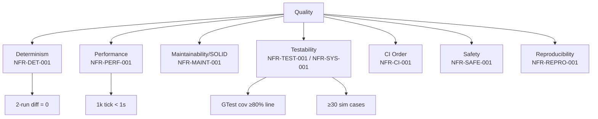
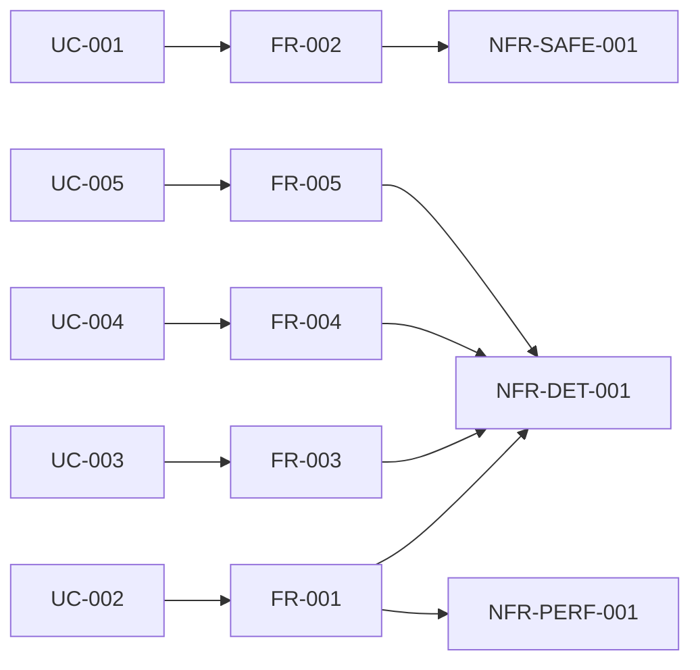

# 요구사항 (FR / NFR) — RVC Cleaning Controller

본 문서는 `arch/system.md`와 `arch/usecases.md` 위에서 **기능 요구(FR)**·**비기능 요구(NFR)**를 측정 가능한 형태로 고정한다. ID 체계는 FR-001~005, UC-001~005를 유지한다 (`reproducibility` RULE §1).

## FR (Functional Requirements)

| ID | 설명 | UC | 우선순위 |
|----|------|----|----------|
| **FR-001** | RVC는 회피·탈출 동작 중이 아닐 때 **기본 동작으로 전진하며 청소**한다. 한 tick에서 어떤 회피 조건도 트리거되지 않으면 다음 tick에서도 forward 청소를 유지한다. | UC-001, UC-002 | High |
| **FR-002** | 사용자(Owner)는 청소 세션을 **시작·정지**할 수 있어야 한다. 정지 시 컨트롤러는 청소 파워를 0으로 낮추고 액추에이터에 정지 명령을 보낸다. | UC-001 | High |
| **FR-003** | 전방 장애물이 감지되면 **청소 동작을 멈추고 측면(좌 또는 우)으로 회전한 뒤 다시 전진 청소**한다. 양쪽 모두 열려 있으면 **좌측 우선**(deterministic). | UC-003 | High |
| **FR-004** | 전·좌·우 **삼면이 동시에 막혀 있으면 후진**한다. **후진 종료 조건은 좌측 또는 우측이 열리는 시점**이며, 전방만 열리는 것으로는 후진을 멈추지 않는다(전방만 열린 상태에서 전진 재개 시 같은 함정으로 다시 진입할 수 있기 때문). 좌·우 중 한쪽이 열리는 즉시 그쪽으로 회전(양쪽 모두 열리면 좌측 우선, FR-003 미러)하며, 회전한 tick에는 **전진 명령을 발신하지 않는다**. 다음 tick에서 새 헤딩 기준 전방이 비어 있을 때 정상 전진 청소가 재개된다. `ControllerConfig::maxBackoffTicks` 는 **안전 상한**(0이면 후진 자체를 시도하지 않고 정지 유지). 모든 후진/회전 시퀀스는 `CleaningCoordinator`가 **단일 오케스트레이션**으로 수행한다. | UC-004 | High |
| **FR-005** | 먼지가 감지되면 청소 파워를 **한 단계 상승**시키고 `ControllerConfig::dustBoostTicks` 가 만료되면 원래 파워로 자동 복귀한다(타이머/디바운스). | UC-005 | High |

> Out of scope (future, 비구현): 추가 센서 융합·spot circling·모바일 앱·머신러닝 — `system.md` 향후 확장 절 참조. FR로 발급하지 않는다.

## NFR / 품질

| ID | 설명 | 검증 방법 | 관련 CI/테스트 |
|----|------|-----------|----------------|
| **NFR-DET-001** | 동일 시나리오·동일 시드·동일 빌드에서 컨트롤러의 명령 시퀀스는 **결정적**이어야 한다(부동소수 비결정 금지, 전역 상태 금지). | 시뮬레이터 시나리오 2회 실행 결과 diff = 0. 무작위성은 `ControllerConfig::seed`로 고정. | `system_tests/run_all.py` 결정성 회귀 케이스(ST-029, ST-030). |
| **NFR-PERF-001** | 한 tick 의사결정은 **O(1)** (격자 크기와 무관). 1,000 tick 시나리오가 1 초 이내에 헤드리스 모드로 끝난다. | `run_all.py` 시간 측정 + GTest 마이크로벤치 게이트. | system 테스트 시간 게이트, `rvc_unit_tests` `[Perf]` 케이스. |
| **NFR-MAINT-001** | **SOLID** 위반이 신규 PR에 도입되면 안 된다. 고수준 정책은 `ISensorPort`/`IActuatorPort`만 의존(DIP). 정책별 인터페이스 분리(ISP). | 코드 리뷰 체크리스트 + DCD vs 헤더 정합 점검. 정적 분석 보관(`reports/static-analysis/`). | `archive-static-analysis-report` 단계. |
| **NFR-TEST-001** | **단위·통합 GTest** 라인 커버리지 **≥ 85 %**, 분기 커버리지 **≥ 75 %** 를 **하드 CI 게이트**로 둔다(미달 시 머지 차단). 측정 대상은 `src/` + `include/rvc/` (테스트·시뮬레이터 도구·`_deps/`는 제외). 시스템 테스트는 GTest로 작성하지 않으며 커버리지 산정에서도 제외한다. | `gcovr` 가 빌드 산출 (`reports/coverage/`) — `--fail-under-line 85 --fail-under-branch 75`. | `coverage` job (`needs: integration_tests`). |
| **NFR-SYS-001** | **시스템 테스트 ≥ 30** 케이스, positive/negative 모두 포함. JSON 시나리오마다 `trace` 배열이 RTM §5와 동기화되어야 한다. | `system_tests/run_all.py --sim <rvc_sim>`이 30 케이스 모두 PASS. RTM §5 ↔ JSON `trace` diff = 0. | `system_tests` job (after `integration_tests`). |
| **NFR-CI-001** | GitHub Actions 검증 job 순서는 **build → unit → integration → system**이며, 이전 단계 실패 시 이후 단계는 실행하지 않는다. | `.github/workflows/ci.yml` `needs:` 그래프 점검. | CI 자체. |
| **NFR-SAFE-001** | 컨트롤러는 **세션이 정지** 상태일 때 어떤 액추에이터 명령도 발신하지 않는다(`stopSession()` 이후 `tick()`은 no-op). | `tests/unit/cleaning_coordinator_test.cpp::SessionStopped_NoActuatorCalls`. | `unit_tests`. |
| **NFR-REPRO-001** | LLM·작성자가 바뀌어도 `arch/`·`reproducibility` RULE·RTM 만으로 동일 동작에 수렴해야 한다. | 신규 작성자 체크리스트(`/ooad/review-phase-checkpoints`). | 머지 전 자가 점검. |

## 추적 (UC ↔ FR)

| UC | FR |
|----|----|
| UC-001 Start/Stop Cleaning Session | FR-002 (+ FR-001 baseline) |
| UC-002 Forward Cleaning (default) | FR-001 |
| UC-003 Avoid Partial Obstacle | FR-003 |
| UC-004 Escape Triple-Blocked Enclosure | FR-004 |
| UC-005 Boost Power on Dust | FR-005 |

전체 추적은 `arch/vnv/traceability-matrix.md`이 단일 근거(SSoT)다. 본 표는 빠른 참조용 미러이며, 충돌 시 RTM이 이긴다.

## 프로젝트 필수 제약 (V&V·구현)

- **언어·빌드**: C++17 + CMake. 외부 의존은 GoogleTest(서브모듈/FetchContent)와 표준 라이브러리만.
- **검증 단계 분리**:
  1. `rvc_unit_tests` (격리 단위, stub/fake)
  2. `rvc_integration_tests` (실제 결합)
  3. `system_tests/run_all.py` (시뮬 + JSON, 비-GTest)
- **CI 순서(NFR-CI-001)**: build → unit → integration → system → (선택) 정적 분석 보관.
- **SOLID 강제**: 고수준은 인터페이스에만 의존(DIP), 정책별 인터페이스 분리(ISP), 단일 책임(SRP)을 코드 리뷰 게이트로 둔다.
- **추적성**: 새 FR/UC 추가 시 `arch/vnv/traceability-matrix.md` §2·§3·§4·§5·§6를 동일 PR에서 갱신. 테스트 파일에는 `// Trace:`/`// Covers:` 주석 헤더 유지.

## Utility Tree (요약)

## 추적 다이어그램 (UC → FR → NFR)

