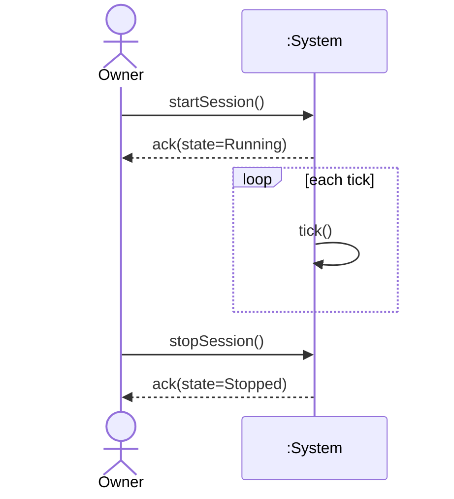

# SSD: UC-001 — Start/Stop Cleaning Session (main success)

## 전제

- 컨트롤러가 초기화 완료. 세션은 Stopped 상태.
- 센서·액추에이터 포트가 부착되어 있다.

## 시퀀스

## 시스템 연산 요약

| 연산 | 의미 |
|------|------|
| `startSession()` | 세션을 Running으로 전이하고 nominal 파워로 액추에이터를 초기화한다. 첫 주행 명령은 다음 `tick()`에서 센서 read 직후 발신한다(blind forward 방지). |
| `stopSession()` | 액추에이터에 정지·power=0 명령 후 Stopped로 전이. |
| `tick()` | 한 주기 동안 센서 읽기 → 정책 결정 → 액추에이터 명령 산출. |
