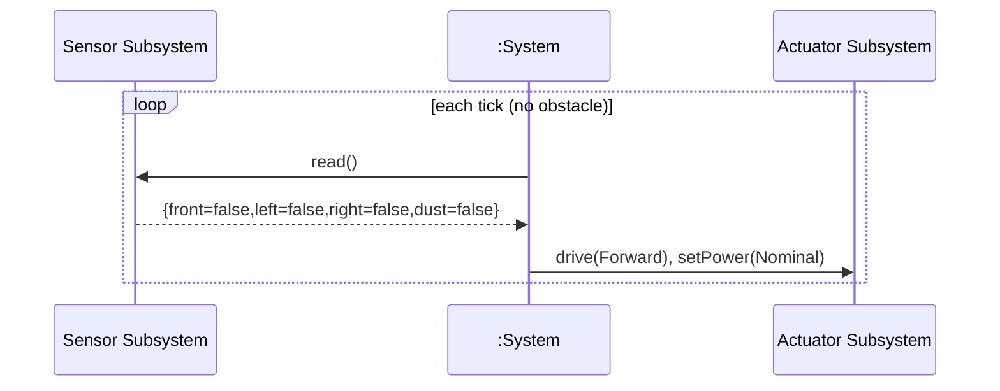

# SSD: UC-002 — Forward Cleaning by Default

## 전제

- 세션이 Running. 모든 센서 false.

## 시퀀스

```mermaid
sequenceDiagram
  participant Sensors as Sensor Subsystem
  participant Sys as :System
  participant Acts as Actuator Subsystem
  loop each tick (no obstacle)
    Sys->>Sensors: read()
    Sensors-->>Sys: {front=false,left=false,right=false,dust=false}
    Sys->>Acts: drive(Forward), setPower(Nominal)
  end
```

## 시스템 연산 요약

| 연산 | 의미 |
|------|------|
| `tick()` | 회피·먼지 트리거가 없으면 forward + nominal 파워를 유지. |
