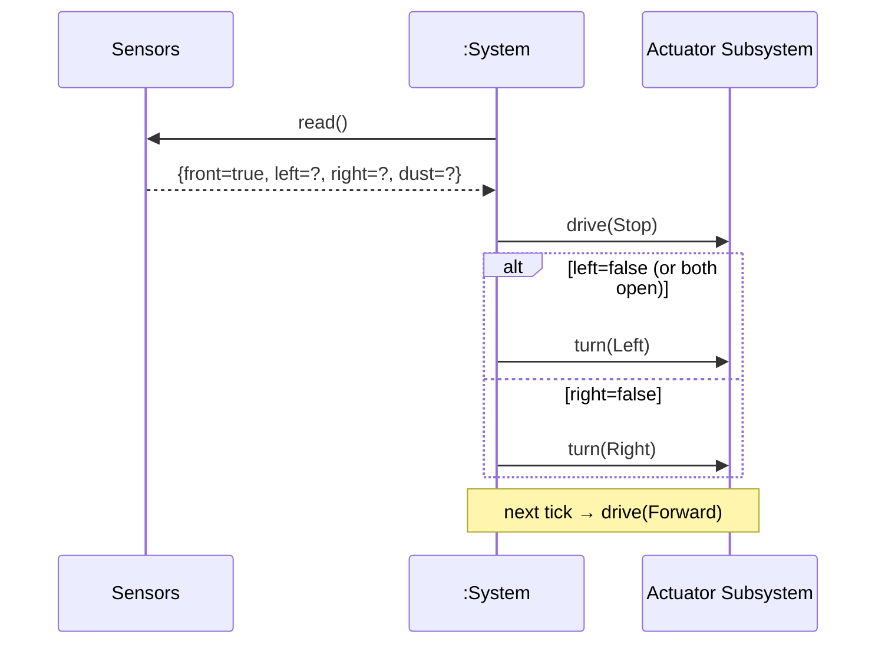

# SSD: UC-003 — Avoid Partial Obstacle

## 전제

- 세션 Running. `front=true`, 좌·우 중 ≥1쪽 열려 있음.

## 시퀀스

## 시스템 연산 요약

| 연산 | 의미 |
|------|------|
| `tick()` | 부분 장애물 시 stop → turn(Left|Right) 한 번 → 다음 tick에서 forward. |
| `turn(direction)` | 양쪽 열림 시 deterministic Left 우선. |
