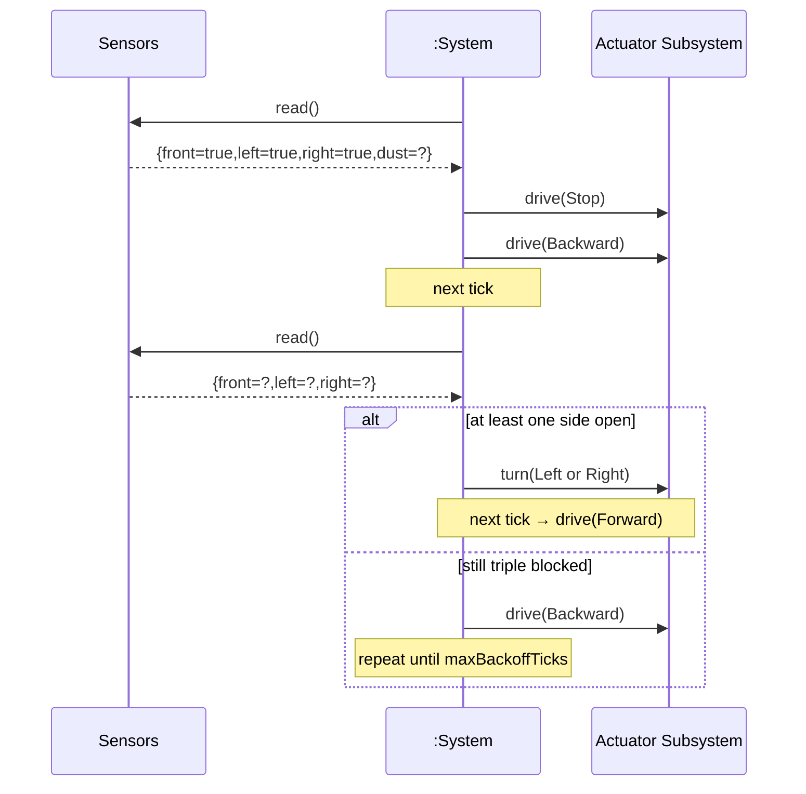

# SSD: UC-004 — Escape Triple-Blocked Enclosure

## 전제

- 세션 Running. `front=true && left=true && right=true`.

## 시퀀스

## 시스템 연산 요약

| 연산 | 의미 |
|------|------|
| `tick()` | 삼면 막힘 인지 → Stop+Backward (한 tick) → 다음 tick에서 측면 열림 시 turn → forward. |
| 정책 보조 | `NavigationPolicy::plan_escape_enclosure`는 단순 회전 보조이며, 시퀀스 자체는 코디네이터 소유. |
