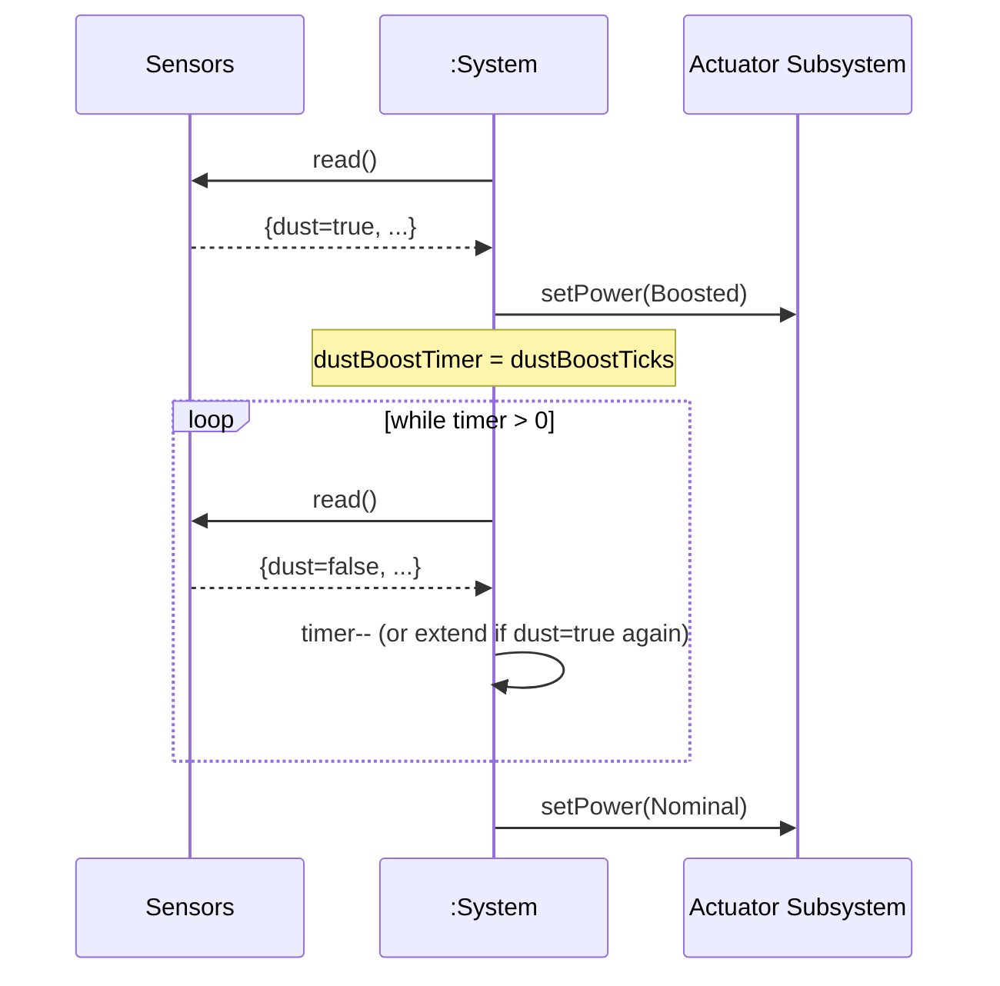

# SSD: UC-005 — Boost Power on Dust

## 전제

- 세션 Running. `dust=true`가 한 tick 이상 보고됨.

## 시퀀스

## 시스템 연산 요약

| 연산 | 의미 |
|------|------|
| `tick()` | dust=true 시 부스트 진입(Power=Boosted) + 타이머 설정/연장. 타이머 만료 시 nominal 복귀. |
