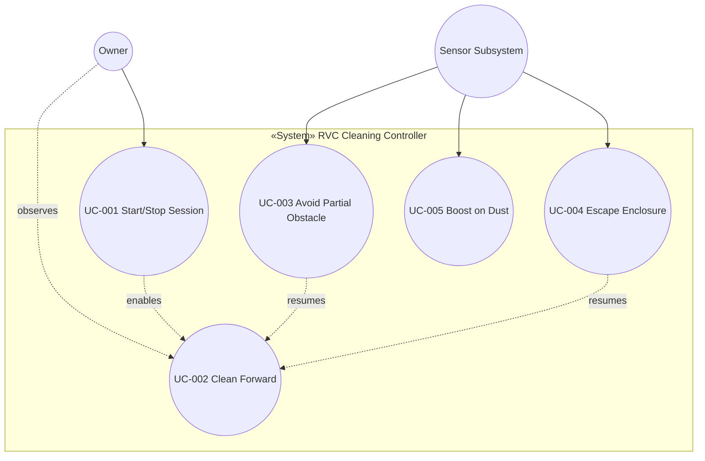

# Use Case 목록 — RVC Cleaning Controller

## 개요

본 문서는 `arch/system.md`에서 정의한 RVC 자동 청소 SW 컨트롤러의 **사용자 가치 단위**를 유스케이스로 추출한다. 시스템은 블랙박스 관점이며, 내부 클래스 이름은 사용하지 않는다.

## 식별 기준

- 액터가 시스템을 통해 달성하는 **단일 목표** 단위로 분리.
- `reproducibility` RULE §2의 제품 불변조건과 1:1 매핑되는 유스케이스를 우선 식별.
- HW 저수준 제어, 모바일 앱, 추가 센서 융합 등은 **future**로 분류하고 본 표에는 포함하지 않는다.

## Use Case 목록

| ID | Name | 요약 | Primary Actor | 우선순위 | ASR |
|----|------|------|---------------|----------|-----|
| UC-001 | Start and Stop a Cleaning Session | Owner가 자동 청소 세션을 시작·정지하고, 정지 시 모든 청소 동작이 안전하게 종료된다. | Owner | High | Y |
| UC-002 | Clean Forward by Default | 회피·탈출 트리거가 없을 때 RVC는 전진하며 청소한다(기본 행동). | Owner (passive) | High | Y |
| UC-003 | Avoid a Partial Obstacle | 전방 장애물을 만나면 청소 동작을 멈추고 좌 또는 우로 회전한 뒤 다시 전진 청소한다. 양쪽 모두 열려 있으면 좌측 우선. | Sensor Subsystem | High | Y |
| UC-004 | Escape a Triple-Blocked Enclosure | 전·좌·우가 동시에 막혀 있으면 후진하고, 측면 통로가 생기면 그쪽으로 회전한 뒤 전진 청소한다. | Sensor Subsystem | High | Y |
| UC-005 | Boost Cleaning Power on Dust | 먼지가 감지되면 일정 tick 동안 청소 파워를 한 단계 부스트하고 자동 복귀한다. | Sensor Subsystem | High | Y |

> **ASR 메모**: 5개 UC 모두 결정적 정책·실시간 분기·상태 전이를 동반하므로 ASR 후보다. 본 과제 규모상 모두 SSD·시퀀스를 작성한다.

## UC 다이어그램 (Mermaid)

## 핵심 ASR UC 요약

- **UC-003 / UC-004**: 부분 장애물과 삼면 막힘은 분기·정책 차이가 커서 별도 UC로 유지한다(`reproducibility` RULE §2). 동일 SW 분기 트리에서 **부분 회피 vs 탈출 오케스트레이션**을 혼동하지 않도록 분리.
- **UC-005**: 먼지 부스트는 시간 한도(`dustBoostTicks`)와 자동 복귀를 동반하므로 다른 UC와 별개로 상태가 진행된다.
